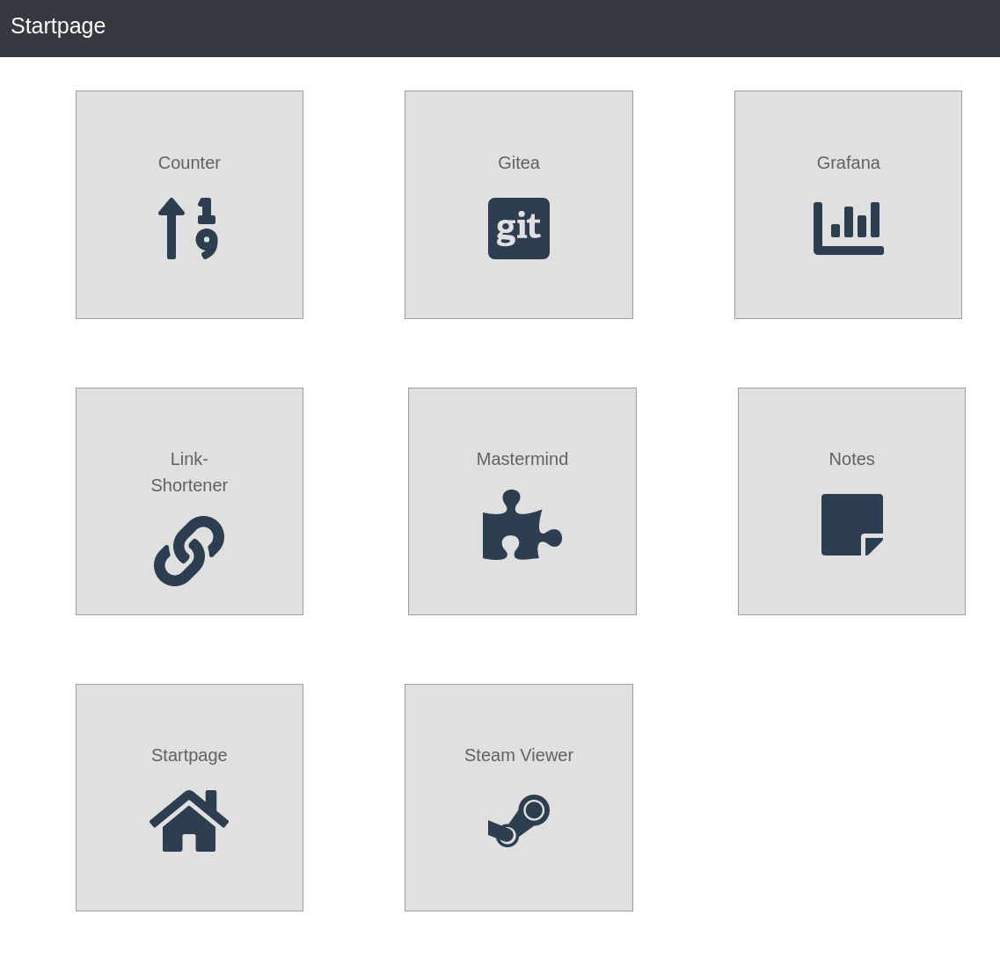

# Startpage

Startpage for my server



## Project setup

```sh
yarn
```

### Compiles and hot-reloads for development

```sh
yarn serve
```

### Compiles and minifies for production

```sh
export BASE_URL=/startpage
yarn build
```

### Run linters

```sh
yarn lint:prettier
yarn lint:vue
```

### Run formatters

```sh
yarn prettier
yarn vue
```
